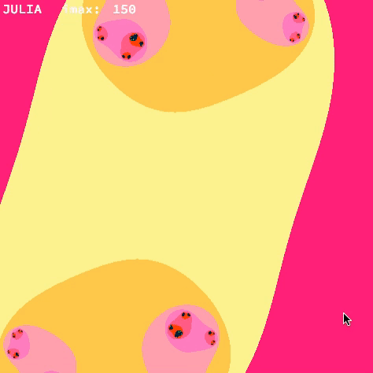
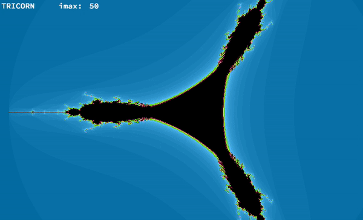
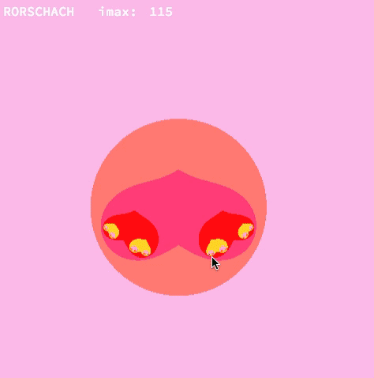

# Fdf
2nd project of [42 School](https://www.42.fr) Computer Graphics Branch.

## Description

This project explores fractals, mathematical sets that exhibit a repeating pattern displayed at every scale.

## Features

- Multiple fractals : Mandelbrot, Julia, Burningship, Juju (Julia variation), Tricorn, Rorscharch
- Increase and decrease max iteration for shape calculation
- Zoom in and out with the scroll wheel of the mouse
- Change the parameters of the fractal when moving the mouse
- Different colors patterns

## Usage

```
$> make
$> ./fractol MANDELBROT
$> ./fractol JULIA
$> ./fractol BURNINGSHIP
$> ./fractol JUJU
$> ./fractol TRICORN
$> ./fractol RORSCHACH
```

## Keys

<table width="100%">
  <thead>
  <tr>
    <td width="40%" height="60px" align="center" cellpadding="0">
      <strong>Description</strong>
    </td>
    <td width="10%" align="center" cellpadding="0">
      <span style="width:70px">&nbsp;</span><strong>Key(s)</strong><span style="width:50px">&nbsp;</span>
    </td>
  </tr>
  </thead>
<tbody>
  <tr>
    <td valign="top" height="30px">Exit the program</td>
    <td valign="top" align="center"><kbd>&nbsp;esc&nbsp;</kbd></td>
  </tr>
  <tr>
    <td valign="top" height="30px">Reinitiate the map</td>
    <td valign="top" align="center"><kbd>&nbsp;return&nbsp;</kbd></td>
  </tr>
  <tr>
    <td valign="top" height="30px">Move the fractal along the X or Yaxis</td>
    <td valign="top" align="center"><kbd>&nbsp;◄&nbsp;</kbd> <kbd>&nbsp;►&nbsp;</kbd><kbd>&nbsp;▲&nbsp;</kbd> <kbd>&nbsp;▼&nbsp;</kbd></td>
  </tr>
    <td valign="top" height="30px">Increase or decrease the number of iterations</td>
    <td valign="top" align="center"><kbd>&nbsp;p&nbsp;</kbd> <kbd>&nbsp;m&nbsp;</kbd></td>
  </tr>
    <td valign="top" height="30px">Change color patters</td>
    <td valign="top" align="center">
      <kbd>&nbsp;7&nbsp;</kbd><kbd>&nbsp;8&nbsp;</kbd><kbd>&nbsp;9&nbsp;</kbd><br/>
      <kbd>&nbsp;4&nbsp;</kbd><kbd>&nbsp;5&nbsp;</kbd><kbd>&nbsp;6&nbsp;</kbd><br/>
      <kbd>&nbsp;1&nbsp;</kbd><kbd>&nbsp;2&nbsp;</kbd><kbd>&nbsp;3&nbsp;</kbd>
    </td>
  </tr>
  </tr>
    <td valign="top" height="30px">Zoom in and out</td>
    <td align="center"></td>
  </tr>
  </tr>
    <td valign="top" height="30px">Change fractal parameters by moving the mouse cursor</td>
    <td align="center"></td>
  </tr>
  </tr>
    <td valign="top" height="30px">Change fractal type (1rst letter of the fractal name)</td>
    <td valign="top" align="center"><kbd>&nbsp;m&nbsp;</kbd><kbd>&nbsp;j&nbsp;</kbd>
      <kbd>&nbsp;b&nbsp;</kbd><kbd>&nbsp;u&nbsp;</kbd><kbd>&nbsp;t&nbsp;</kbd><kbd>&nbsp;r&nbsp;</kbd></td>
  </tr>
  </tbody>
</table>

## Output examples
### Mandelbrot


### Julia


### Burningship


### Tricorn


### Rorscharch

